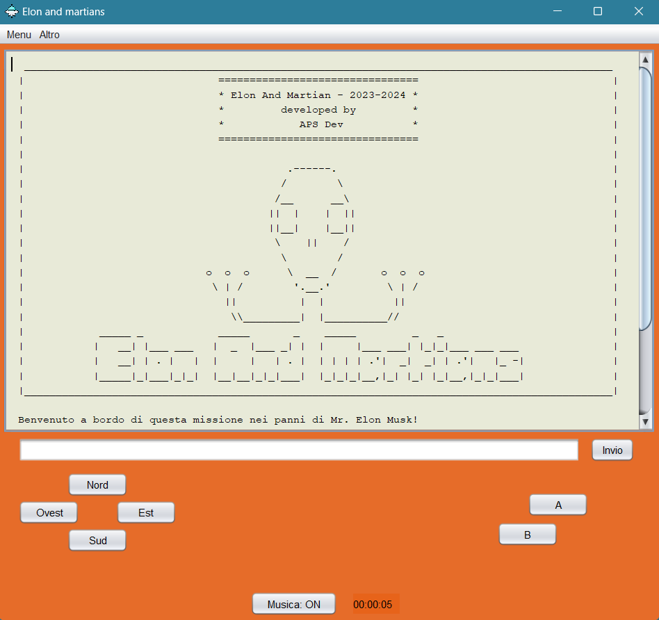
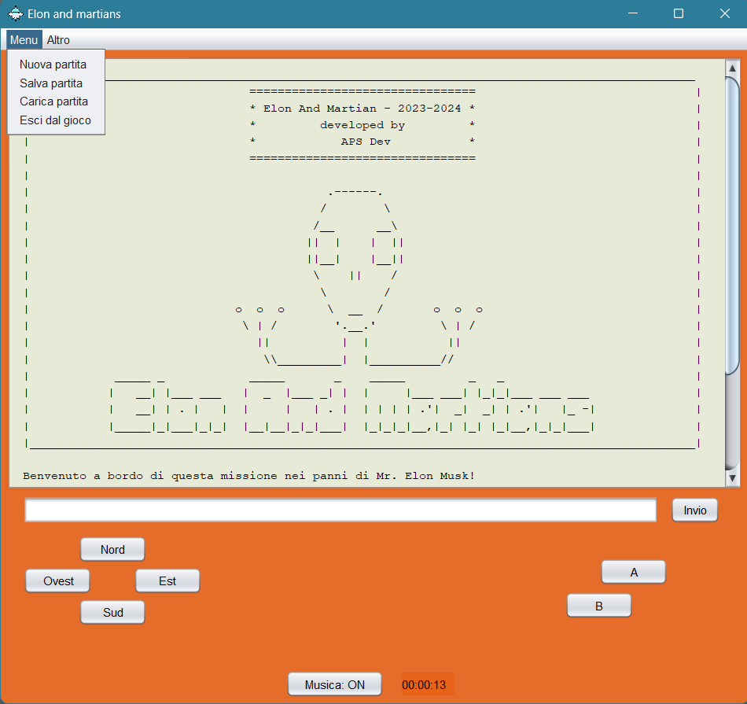
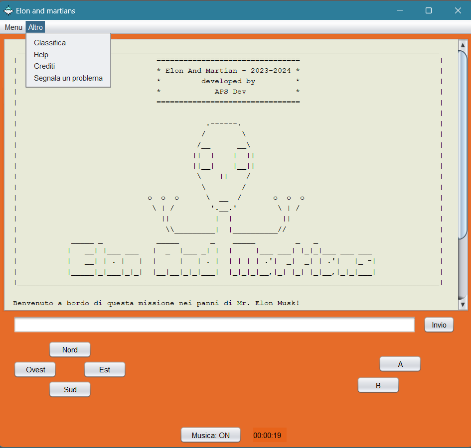
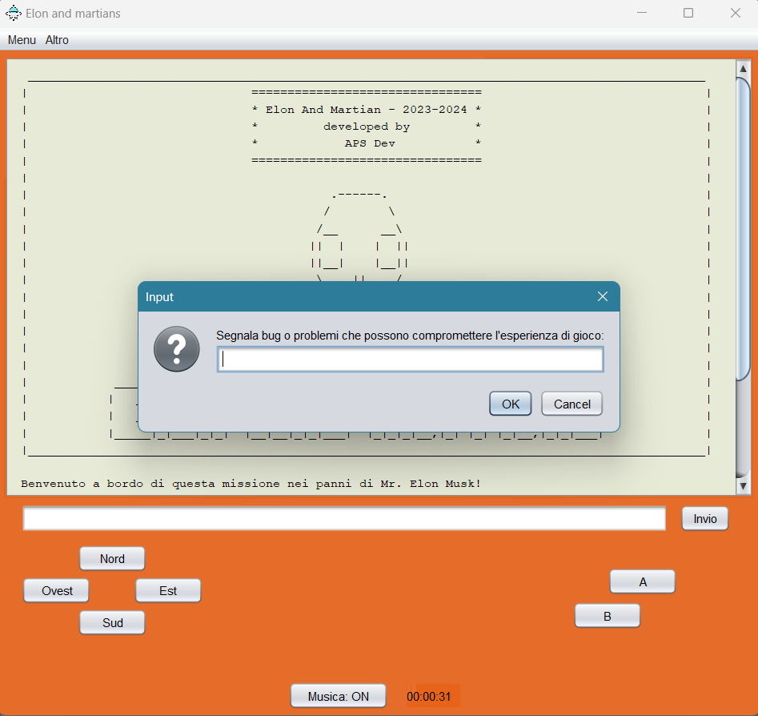
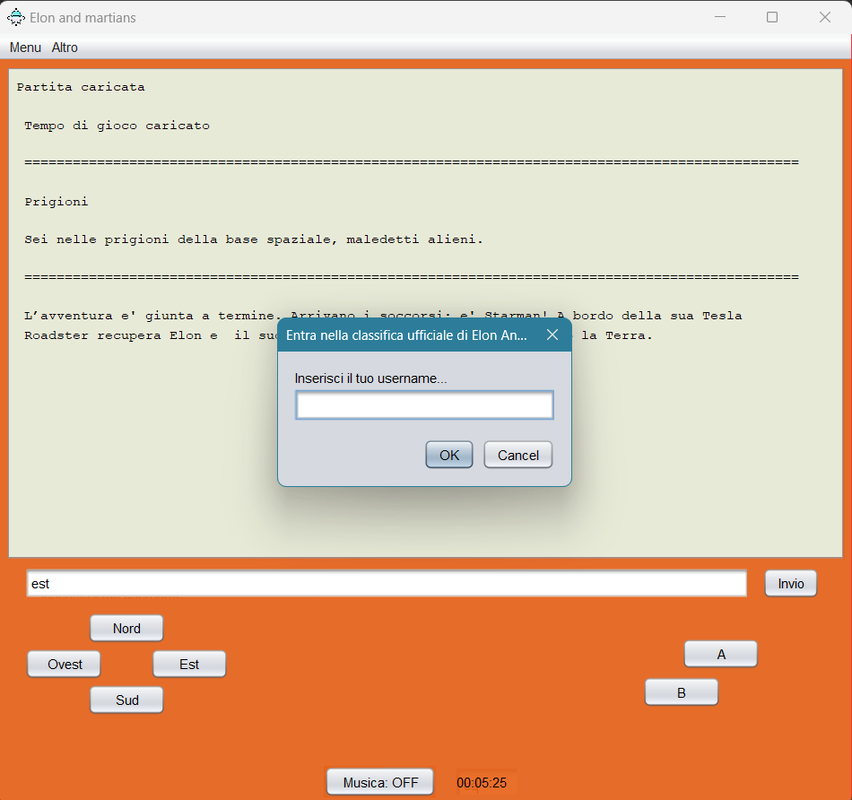
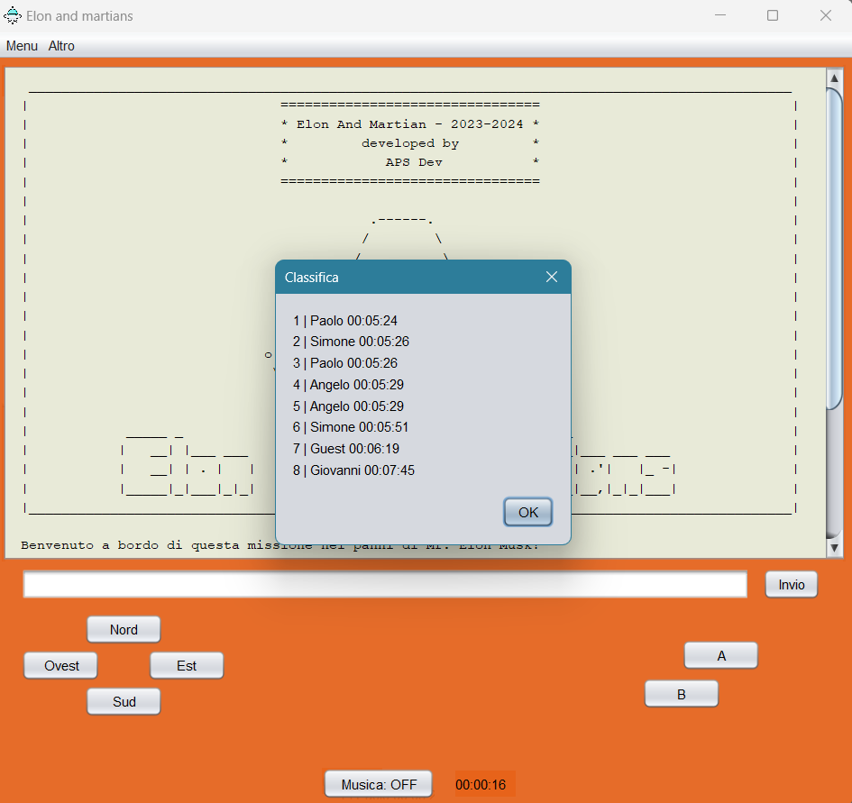
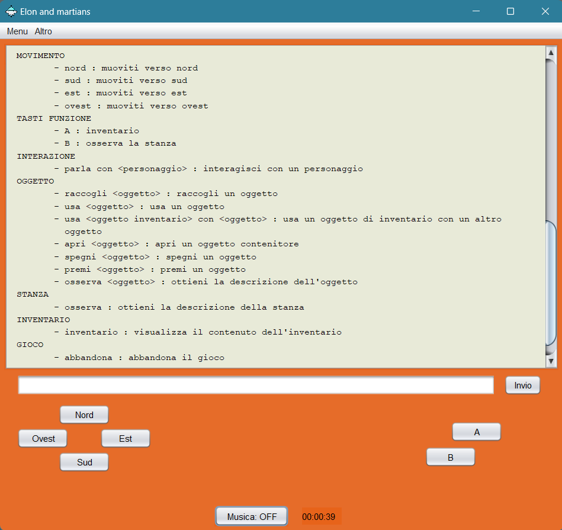
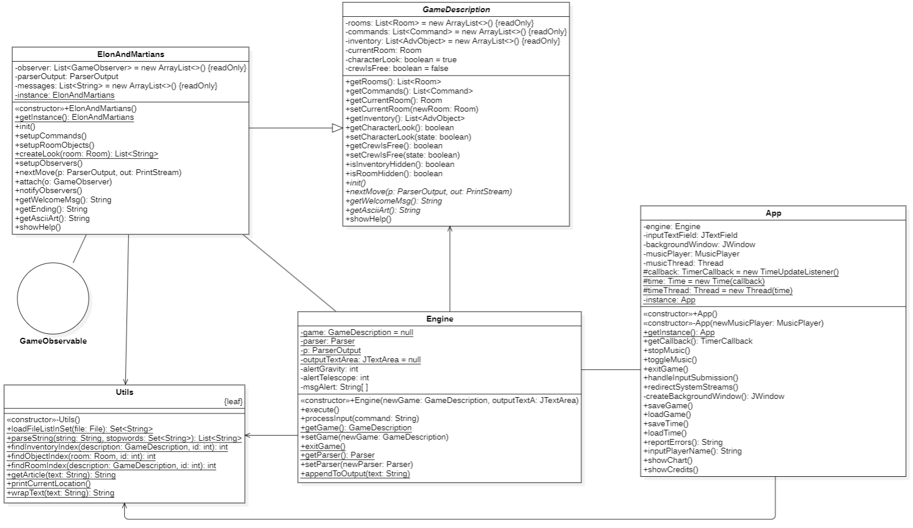
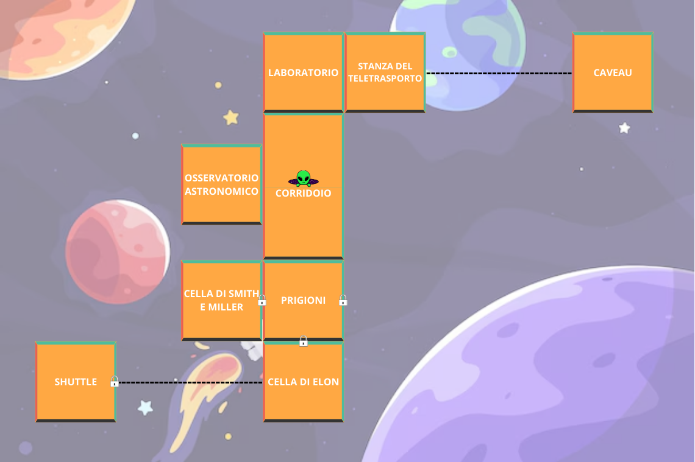

# Documentazione
___
## Indice
___
1. [Componenti del gruppo]( #1-componenti-del-gruppo)
2. [Descrizione caso di studio]( #2-descrizione-caso-di-studio)
3. [Diagramma delle classi]( #3-diagramma-delle-classi)
4. [Specifica Algebrica]( #4-specifica-algebrica)
5. [Applicazione degli argomenti del corso]( #5-applicazione-degli-argomenti-del-corso)
6. [Soluzioni]( #6-soluzioni)

# 1. Componenti del gruppo
___

- [Simone Pugliese](https://github.com/SimonePugliese0)
- [Paolo Scicutella](https://github.com/paoloscicu02)
- [Angelo Polito](https://github.com/angpolito)

[Torna all'indice](#indice)

# 2. Descrizione caso di studio
___
L'avventura mista "Elon and Martians" è ambientata in uno scenario fantascientifico che vede come protagonista Elon
e il suo equipaggio intenti ad ottenere informazioni sul pianeta Marte al fine di colonizzarlo. 
Poiché la missione prende una piega inaspettata, l'obiettivo del gioco è quello di evadere dalla prigione marziana e 
rientrare sulla Terra.  

- L'interfaccia del gioco è ispirata ad una console retro e dispone di tasti direzionali, due tasti funzione, un tasto 
per l'attivazione/disattivazione della musica e un display che consente l'interazione testuale.  
  

L'applicazione dispone inoltre di una menu bar che consente di accedere ad una sezione di gestione del gioco e ad una 
secondaria dove è possibile visualizzare i crediti del gioco e la classifica aggiornata, oppure segnalare un bug agli 
sviluppatori. 
L'applicazione inoltre consente il salvataggio e il caricamento dell'avventura, memorizzando in un file: la stanza
corrente, l'inventario, lo stato degli oggetti nelle stanze e quello del protagonista al momento del salvataggio.  
- Menu di gioco:   
   
- Menu secondario:   
   
- Segnalazione bug:   
   

Per la realizzazione della classifica è stato impiegato un database H2 che tiene conto dei campi "username", scelto dal 
giocatore, e "tempo", gestito da un thread apposito e automaticamente rilevato al momento dell'inserimento del record 
da parte del vincitore. 
- Inserimento record:   
   
- Visualizzazione classifica:   
   

- All'inserimento del comando "help" risulta disponibile l'elenco dei comandi.  
  

[Torna all'indice](#indice)

# 3. Diagramma delle classi
___

Il seguente diagramma rappresenta la parte di codice relativa al contenuto del package 'map.adventure.elonandmartians.game' e all'interfaccia swing 'App', che risulta significativa nella gestione della logica di gioco e dell'interazione con l'utente.

_(Diagramma realizzato con StarUML)_

[Torna all'indice](#indice)

# 4. Specifica Algebrica
___
**SPECIFICA SINTATTICA**

        TIPI: inventory, AdvObject, boolean, position

        OPERATORI:
          - createInventory() → inventory
          - isEmpty(inventory) → boolean
          - get(position, inventory) → AdvObject
          - add(AdvObject, position, inventory) → inventory
          - remove(position, inventory) → inventory

**SPECIFICA SEMANTICA**

        TIPI:
          - inventory: insieme delle sequenze l = <o1, o2, ..., on> , n >= 0 , di elementi di tipo AdvObject dove l'elemento i-esimo ha valore o(i) e posizione pos(i).
          - AdvObject: insieme di elementi univoci di tipo oggetto.
          - boolean: insieme dei valori di verità.
          - position: insieme dei numeri interi positivi.
        
        PARAMETRI:
          - declare i: inventory, p: position, o: AdvObject

        OPERATORI:
          - createInventory() = i'
            POST: i' = <>
          - isEmpty(i) = b
            POST: if (l = <>) : b = true
                  else        : b = false altrimenti
          - get(p, i) → o
            PRE: p = pos(i) , 1 <= i <= n
            POST: o = o(i)
          - add(o, p, i) → i'
            PRE: p = pos(i) , 1 <= i <= n
            POST: i' = <o1, o2, ..., o(i-1), o, o(i+1), ..., on>
          - remove(p, i) → i'
            PRE: p = pos(i) , 1 <= i <= n
            POST: i' = <o1, o2, ..., o(i-1), o(i+1), ..., on>

**SPECIFICA DI RESTRIZIONE**

        get(p', createInventory()) = error
        get(p', add(o, p, i)) = error , (i = <> , p' != p)
        get(p', add(o, p, i)) = error , (i = <o1, ..., on> , n >= 1 , p' > n)
        remove(p', createInventory()) = error
        remove(p', add(o, p, i)) = error , (i = <> , p' != p)
        remove(p', add(o, p, i)) = error (i = <o1, ..., on> , n >= 1 , p' > n)

**COSTRUTTORI E OSSERVAZIONI**

|  Osservazioni  | Costruttore di i' |                                                                                                     |
|:--------------:|:-----------------:|:---------------------------------------------------------------------------------------------------:|
|                | createInventory() |                                            add(o, p, i)                                             |
|  isEmpty(i')   |       true        |                                                false                                                |
|  get(p', i')   |       error       |          if((isEmpty(i) and p' = p) or (!isEmpty(i) and p' <= n)) then p else error                 |
| remove(p', i') |       error       | if(isEmpty(i) and p' = p) then createInventory() else if(!isEmpty(i) and p' <= n) then i else error |

[Torna all'indice](#indice)

# 5. Applicazione degli argomenti del corso
___

- **File**:
  - sono stati utilizzati file seriali per la gestione del salvataggio e del caricamento dello stato della partita;
  - è stato utilizzato un file di testo (.csv) per la raccolta, da parte di un server, di eventuali segnalazioni di bug/problemi effettuate dagli utenti.

- **JDBC**: è stato utilizzato per la creazione e visualizzazione di una speedrun leaderbord che salva il nickname di ogni giocatore che termina il gioco e il tempo trascorso dall'inizio della partita.

- **Lambda Expression**: sono state utilizzate per semplificare l'implementazione delle interfacce funzionali:
  - in particolar modo per gli ascoltatori di eventi: sia per le azioni su bottoni che quelle sui menu.
  - abbiamo preferito utilizzare una Lambda Expression nel metodo preposto all'aggiornamento della Jlabel con il tempo, piuttosto che una classe anonima, per una questione di leggibilità e concisione.

- **Thread**:
  - è stato dedicato un thread alla riproduzione della musica di sottofondo;
  - è stato dedicato un thread al cronometraggio del tempo di gioco;
  - il server preposto alla segnalazione di problemi/bugs gestisce ogni connessione avviando un nuovo thread al fine di consentire la gestione simultanea di più client.

- **Swing**: la classe `App` è stata utilizzata per implementare la GUI del gioco, le sue caratteristiche principali sono:
  1. **Simulazione della Console:**
     - Display (`JTextArea`) che visualizza le risposte del gioco in seguito agli input dell'utente.
     - Area di input (`JTextField`) dove l'utente può digitare comandi (che verranno elaborati dal motore di gioco (`Engine`)).

  2. **Menu della GUI:**
     - Il primo menu ("Gioco") presenta opzioni quali "Nuova partita", "Salva partita", "Carica partita" e "Esci dal gioco".
     - il secondo menu ("Altro") presenta opzioni per visualizzare la leaderboard, richiedere la stampa dell'help, visualizzare i crediti del gioco e segnalare eventuali problemi".

  3. **Pulsanti dedicati alle azioni del giocatore:**
     - Pulsanti che simulano delle frecce direzionali e consentono il movimento del giocatore tra le stanze;
     - Pulsanti che simulano l'inserimento dei comandi `guarda` e `inventario`;

  4. **Visualizzazione del Tempo di Gioco:**
     - Un display (`JLabel`) indica il tempo trascorso dall'inizio della partita.

  6. **Musica di Sottofondo:**
     - Gestisce la riproduzione della musica di sottofondo tramite un oggetto `MusicPlayer`.
     - Pulsante che permette di attivare/disattivare la musica.

  8. **Gestione della trasparenza e chiusura:**
     - Include una finestra di sfondo semi-trasparente (`JWindow`) per migliorare l'aspetto grafico.
     - Gestisce la chiusura della finestra principale con conferme di uscita per evitare chiusure accidentali.

- **Socket**:
  - la classe `ErrorReport` è progettata per inviare segnalazioni a un server mediante una connessione socket;
  - la classe `JabberSever` avvia un server socket sulla medesima porta e accetta connessioni in un ciclo infinito; per ciascuna connessione avvia un nuovo thread:
    - `ClientHandler`gestisce la comunicazione con il client: legge i messaggi, registra gli errori in un file .csv e invia risposte al client.

- **RESTful**: al fine di "dar vita" al personaggio Kif Kroker, abbiamo gestito il dialogo con quest ultimo (nel caso in cui Elon sia travestito da alieno), facendo in modo che sia una intelligenza artificiale generativa (GPT-4o) a interpretarne il ruolo:
  - il codice utilizza un approccio Stateless, in modo che ogni richiesta da parte del client sia autocontenuta.
  - le richieste sono state formulate utilizzando metodi/verbi HTTP (`.POST`).
  - è stato utilizzato il formato JSON: gli oggetti `HashMap` vengono convertiti in stringhe JSON, per poi diventare il corpo delle richieste HTTP POST inviate all'API di ChatGPT.

Il sistema è composto da 10 package:

- package map.adventure.elonandmartians.database, contiene:
  - Database (Classe)
  - leaderboard_db.mv.db (File .mv.db)
- package map.adventure.elonandmartians.game, contiene:
  - ElonAndMartians (Classe)
  - Engine (Classe)
  - GameDescription (Classe astratta)
  - Utils (Classe final)
  - GameObservable (Interfaccia)
- package map.adventure.elonandmartians.observer, contiene:
  - InventoryObserver (Classe)
  - LookAtObserver (Classe)
  - MoveObserver (Classe)
  - OpenObserver (Classe)
  - PickUpObserver (Classe)
  - PushObserver (Classe)
  - ShootObserver (Classe)
  - TalkObserver (Classe)
  - TurnOffObserver (Classe)
  - UseObserver (Classe)
  - GameObserver (Interfaccia)
- package map.adventure.elonandmartians.parser, contiene:
  - Parser (Classe)
  - ParserOutput (Classe)
- package map.adventure.elonandmartians.socket, contiene:
  - map.adventure.elonandmartians.socket.client (Package)
  - map.adventure.elonandmartians.socket.server (Package)
- map.adventure.elonandmartians.socket.client, contiene:
  - ErrorReport (Classe)
- map.adventure.elonandmartians.socket.server, contiene:
  - ClientHandler (Classe)
  - JabberServer (Classe)
  - error_log.csv (File .csv)
- package map.adventure.elonandmartians.swing, contiene:
  - App (Classe)
  - App.form (File .form)
- package map.adventure.elonandmartians.thread, contiene:
  - MusicPlayer (Classe)
  - Time (Classe)
- package map.adventure.elonandmartians.type, contiene:
  - AdvObject (Classe)
  - AdvObjectContainer (Classe)
  - Command (Classe)
  - CommandType (Classe enumerativa)
  - Room (Classe)
- package map.adventure.elonandmartians.rest, contiene:
  - ChatGPTIntegration (Classe)

[Torna all'indice](#indice)

# 6. Soluzioni
___

**ATTENZIONE QUESTA E' UNA SEZIONE SPOILER**

Si descrivono formalmente i passaggi che devono essere svolti per superare le stanza e arrivare all'obiettivo finale.

    Shuttle con problema al motore: 

    - spegni motore.

    Cella di Elon: 

    - Inventario: sei in possesso della nano-chiave universale, sfuggita alla perquisizione.
    - usa chiave con serratura.
    
    Nord -> Prigioni:

    - Non puoi muoverti prima di aver ripristinato la gravità terrestre:
      - premi bottone -> 3

    Nord -> Corridoio

    Ovest -> Osservatorio astronomico

    - prendi tuta.

    Est -> Corridoio

    Nord -> Laboratorio

    - prendi forbici.
    
    - Per ottenere i campioni di dna da immettere nel dispositivo, combina gli oggetti dell'inventario:
      - usa forbici con tuta.
      - usa forbici con capelli.

    - Per cambiare le proprie sembianze, inserisci i campioni nel dispositivo:
      - usa ritaglio con dispositivo.
      - usa campione con dispositivo.

    Est -> Stanza del teletrasporto

    - usa teletrasporto.

    Caveau:
    
    - prendi fucile, servirà per sparare all'alieno ostile nel corridoio.
    - prendi ascia, servirà per rompere lo scrigno.
    - usa ascia con scrigno.
    - per raccogliere la gemma necessaria ad aprire l'ultima porta di gioco:
      - apri scrigno.
    - usa teletrasporto.
    
    Stanza del teletrasporto:

    Ovest -> Laboratorio

    - Per riottenere sembianze umane è necessario riutilizzare il dipositivo:
      - usa dispositivo. 
    
    Sud -> Corridoio

    - Per eliminare l'alieno ostile nel corridoio, sarà necessario sparare con il fucile, cosi facendo
      si potrà raccogliere la tessera di riconoscimento necessaria nell'Osservatorio astronomico:
      - spara alieno.

    Ovest -> Osservatorio astronomico

    - usa tessera con trasmettitore.

    - Attivando il trasmettitore, verrà richiesta una parola da inviare al pianeta terra:
      - aiuto.

    Est -> Corridoio
    
    Sud -> Prigioni

    - Con la tessera è possibile liberare i proprio compagni dalle prigioni:
      - usa tessera con cella. 

    - Per aprire il portone della base, è necessario incastonare la gemma:
      - usa gemma con portone.

    Est -> Giardino di cristallo

    Fine

    NOTA BENE: il gioco darà la possibilità al giocatore di proseguire l'avventura anche senza riprendere le sembianze
    umane o senza liberare i propri compagni dalle prigioni, incorrendo in finali di gioco perdenti o incompleti.

Di seguito la mappa dell'avventura:

[Torna all'indice](#indice)